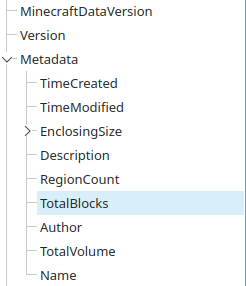
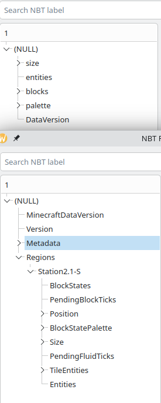
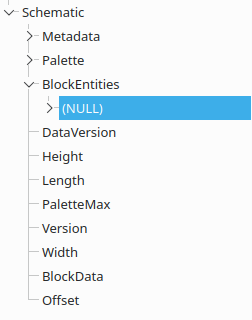

# 结构文件

在Minecraft中，我们可能要用到各种各样的结构文件。常见的就是**原版NBT文件**（机械动力的蓝图文件也是这种）、**litematic投影文件**、**schema投影文件**（本文只介绍**v3**版本）。本文尽量以图文并貌的形式介绍这三种文件，希望能对你有所帮助。

## 实现

为啥先把实现放在前面呢？因为我想这样就更好地介绍不同文件间的差异了。从共通之处出发，兼容不同之处，这也许就是一种哲学吧？

在目前的`dhlrc`中，使用一个通用的`Region`结构来存储结构。它是将共通的部分进行存储，以减少三种格式的差异，以便进行后续处理。

通用结构的总览（因为C语言没有泛形，所以里面的类型都是`GPtrArray`的typedef。~说实话要是有泛形我也可能要用typedef，或者用using~）：

编者著：这是旧版的实现，新式的为了减少内存用量稍有不同，但是`Palette`的实现是相同的，因此不在下面继续写其实现。

```C
typedef struct _Region
{
    /** The base information */
    int data_version;
    /** The size of region */
    RegionSize* region_size;
    /** The block info array */
    BlockInfoArray* block_info_array;
    /** The Palette info array*/
    PaletteArray* palette_array;
} Region;
```

`BlockInfo`和`Palette`的实现：

```C
typedef struct BlockInfo{
    int index;
    Pos* pos;
    char* id_name;
    int palette;
    NBT* nbt;
    NbtInstance* instance;
} BlockInfo;

typedef struct Palette{
    char* id_name;
    DhStrArray* property_name;
    DhStrArray* property_data;
} Palette;
```

注：新版采用以下结构，以容纳更多基础信息和减少内存用量，同时未来可能还会增加结构偏移以支持更多特性。

```C
typedef struct Region
{
  /** The base information */
  int data_version;
  BaseData *data;
  /** The size of region */
  RegionSize *region_size;
  /** The block info array */
  /* 标注：此处是存放方块调色板（此文旧写为偏移）的数组 */
  gint64 *block_array;
  int block_array_len;
  /** Block Entity Array */
  BlockEntityArray *block_entity_array;
  /** The Palette info array*/
  PaletteArray *palette_array;
  /* 标注：此处是临时存放空气位的值，在传递完毕后不应继续使用 */
  int air_palette;
} Region;
```

`BaseData`结构如下：

```C
typedef struct BaseData
{
  /* Default: time of generated */
  GDateTime *create_time;
  /* Default: time of generated */
  GDateTime *modify_time;
  /* Default: "" */
  char *description;
  /* Default: username */
  char *author;
  /* Default: Converted */
  char *name;
} BaseData;
```

具体如何转换比较麻烦~，反正就是硬编~。

## 信息（原版NBT文件没有，Schematics文件不全）



上图是**litematic投影文件**的一些Metadata信息，其实可以一目了解，除了包括了对应的版本以外，还有创建、修改的时间（以unix时间戳储存），还有大小、描述等信息，此处不再赘述。

另注：**原版NBT文件**中存在`DataVersion`的键，但是没有其他信息。**Schematics文件**内同样有用的也只有`DataVersion`的键，其他信息似乎没有litematic投影文件的有标识作用。

## 区域（litematic文件独有）

区域（**Regions**）在litematic文件的根下的Regions下，每个区域独有一个Compound结构。

## 区域信息

### 大小

在**litematic投影文件**中，大小以`Size`的*Compound*存在；而在**NBT文件**中，大小以`size`的*List*存在。其中还有差异的是，**litematic投影文件**有每个tag的键（x、y、z），而**NBT文件**中没有。

在**Schematics文件中**，大小以三个*Short*值存在（依xyz分别为`Width`、`Height`、`Length`）。

### 实体

TODO：此处用得比较少，暂不实现。如果想要转换到**Schematics**格式，此信息100%会丢失！

**新注：不是方块实体！看下面！**

### 方块状态值（BlockStates）——litematic投影文件

此处以`Long Array`的值存在，以位的方式存储着每个方块的调色板（旧记为“偏移”，在`dhlrc`中可能仍会沿用此翻译）（此处应为Palette, 但是不知道怎么翻译好）。~如果按照Java的存储方式（大端序），理应就是直接按位的方式直接存储。~（具体详见litematic项目源代码，此处仅为猜测）

#### 旧版处理

以`dhlrc`项目的代码为例，如果想要取出对应方块的偏移值，则可以使用以下代码：

新注：此代码可能已从项目删除，如果想再看原来的代码，可以看看`region_get_block_palette`（里面有可能有因为之前找bug时猜错原因写的抽象防御代码~，我再也不玩抽象了！~）。

```C
/* The function below uses the implement from another project:
 * "litematica-tools" from KikuGie
 * https://github.com/Kikugie/litematica-tools
 * It uses MIT License, the license file could be found in config/
 * since files in config/ are also from this project.
 */

int lite_region_block_id(LiteRegion* lr, uint64_t index)
{
    int64_t* state = lr->states;
    int bits = lr->move_bits;
    uint64_t start_bit = index * bits;
    int start_state = start_bit / 64;
    int and_num = (1 << bits) - 1;
    int move_num = start_bit & 63;
    int end_num = start_bit % 64 + bits;
    int id = 0;
    if(end_num <= 64)
        id = (uint64_t)(state[start_state]) >> move_num & and_num;
    else
    {
        int move_num_2 = 64 - move_num;
        if( start_state + 1 >= lr->states_num)
            g_error("Out of range!");
        id = ((uint64_t)state[start_state] >> move_num | state[start_state + 1] << move_num_2)& and_num;
    }
    return id;
}
```

如果想要存回去（或者从别的格式转换），则需先把位对应的值塞到数组中，在`dhlrc`中，为了简化逻辑，是采用了`DhBit`结构（本质上还是数组，只是带了个偏移量），然后一位一位地塞进去：

（其实为了节省计算量也做了优化~，该玩的抽象还是得玩的~）

```C
void dh_bit_push_back_bit(DhBit* bit, int b)
{
    if(bit->bits % 64 == 0)
    {
        bit->array = realloc(bit->array, (bit->bits / 64 + 1) * sizeof(int64_t));
        bit->array[bit->bits / 64] = 0;
    }
    bit->array[bit->bits / 64] |= ((int64_t)!!b << (bit->bits % 64));
    bit->bits++;
}
```

#### 新版处理

直接复制数组，待由其他函数处理（~其实有把`Region`实现隐藏的打算，然后全部用函数来调用。不过这一改其实已经差不多了~）。

#### 那么旧版处理丢哪了？

其实还在代码里面保留了，只不过，被分别用来取出`Region`内的`palette`值及`NBT/schematics`格式向`Region`的转换了。

#### **NBT**及**Schematics**文件格式怎么存储方块状态的

**NBT**格式比较抽象，在`blocks`里面塞了`pos`（还是和之前`size`一样是无键的三个值组成的List）和`state`（其实就是对应的palette）。因此，它是唯一一个可以乱序储存的格式（~没这个必要吧~），同时也能不存储一些方块。

**Schematics**格式比**litematic**格式友好但是其实是限制最大的，它通过`BlockData`的Byte Array来存储palette，当方块种类多于127种就要炸了（别以为很大，其实据转换得到的某个文件里面的`PaletteMax`，我的一个投影里面的结构中就已经有94种了！至于为啥可以看看上面的结构存储方式和下面的说明）~这也触发了某个大投影转换去转换不回来的神奇BUG了，然后至于超过127个怎么办还没时间测试~。

### PendingBlockTicks和PendingFluidTicks——litematic文件

未知。

### Position——litematic+schematics文件

与原点的位置偏移量。

**Schematics**格式也有，叫`Offset`，是一个Int Array。

### 方块“偏移”（Palette）

里面存储了方块的大部分信息（其实只有两部分，甚至只有一部分）：名称（**Name**）和属性（**Properties**，如果有）。因此，一个同名的方块可能有多个palette。

投影文件中的**BlockStatePalette**和NBT文件中的**palette**可以说是完全一致的实现，一般认为这种设计应该是源于存档的存储方式。

最有趣的还是**Schematics**格式，直接就是用长文本的键和一个Int值配对，属性就塞在文本里面，~自己解析去吧~。比如没有属性的就是`minecraft:air`，有属性的就是`namespace:block[key1=value1,key2=value2]`

### 方块实体

litematic文件使用**TileEntities**来存储方块实体信息。与**NBT**内塞在**blocks**的**nbt**不同的是，它只是多了表示位置的x、y、z键。**Schematics**内塞在**BlockEntities**的实体，位置使用了Int Array的**Pos**，还有个字符串Id（~不知道何时会填充这个~）。

### 总览（上为NBT下为litematic，另一幅为Schematics）





## 谢谢阅读

~真的有人读完吗？~
